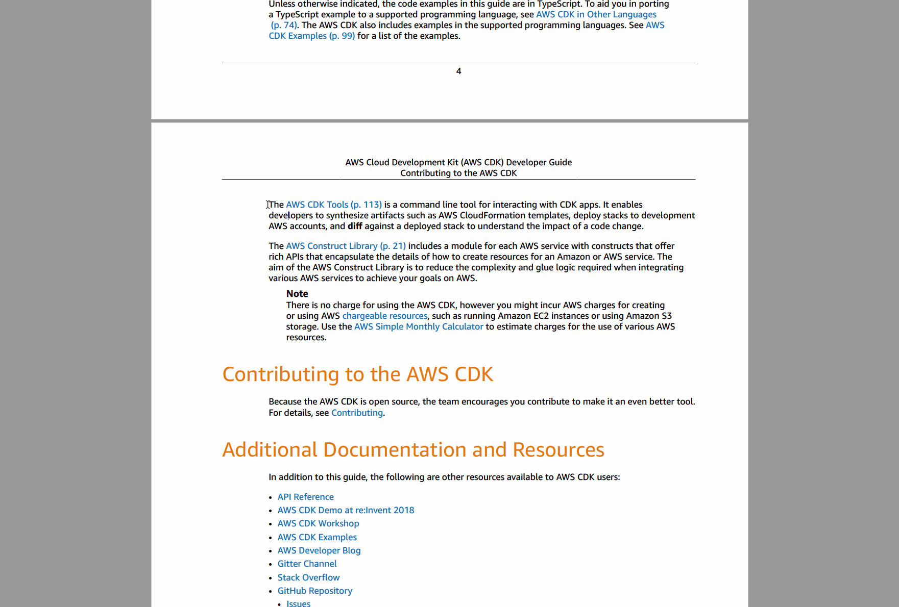

Alfred Workflow for Selected Text Translation for E-Books
==========

## Problem

If we use normal copy and paste flow for translating E-Book(e.g. pdf) text,
weird translation results are displayed due to extra line breaks

## Simple Solution

### Required

You can use Alfred Workflow with Alfred Powerpack

### Install this workflow

1. Download - download [workflow file](https://github.com/goldeneggg/alfred-workflow-selected-text-tralslator/blob/main/selected-text-translator.alfredworkflow)
2. Import - Double-click downloaded workflow file and press `Import` button
3. Setup your Hotkey
    1. Open first Hotkey action in workflow-editor
    2. Set `Hotkey` that you'd like to use (e.g. `Option + Shift + Command + T` (`⌥ ⇧ ⌘ T`)) and press `Save` button

### Usage

1. Select text in E-Book file
2. Press your Hotkey (e.g. `Option + Shift + Command + T` (`⌥ ⇧ ⌘ T`))
3. Auto open translation result page on you browser

### Environment Variables

- `USE_DEEPL` - If set `1`, replace translation tool to DeepL Translator
